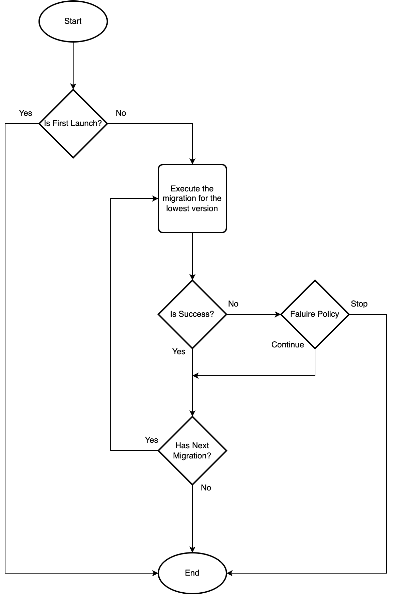

# Android Version Migrator

Android Version Migrator is a utility that allows you to define and execute the necessary logic
during application
updates.

For example, starting with Android 10, public storage can no longer be used. If the existing app
used public storage,
the files managed there need to be moved to app-specific storage. In such cases, this library
executes the migration
logic written by the developer and ensures that it is not executed multiple times.

## Install

```kotlin
dependencyResolutionManagement {
    ..
    repositories {
        ..
        maven("https://maven.pkg.github.com/dylan-kwon/android-version-migrator") {
            credentials {
                username = INPUT-YOUR-USER-NAME
                password = INPUT-YOUR-GITHUB-TOKEN
            }
        }
    }
}
```

```kotlin
implementation("dylan.kwon:version-migrator-android:$version") {
    
}
```

## How To Use

### 1. Extend VersionMigration

Extend VersionMigration to define the version code, failure policy, and migration logic.

The failure policy includes `CONTINUE`, which ignores the failure and proceeds with the next task,
and `STOP`, which
halts
all migration tasks.

```kotlin
object V1 : VersionMigration {
    override val versionCode: Long = 1

    override val policy: VersionMigrationPolicy =
        VersionMigrationPolicy.CONTINUE // or VersionMigrationPolicy.STOP

    override suspend fun migrate(): Result<Unit> {
        return try {
            // Insert your migration logic.
            Result.success(Unit)

        } catch (e: Exception) {
            Result.failure(e)
        }
    }
}
```

### 2. Create Migrator

SequentialVersionMigrator is a migrator that executes registered VersionMigrations sequentially in
ascending order of
their versions.

```kotlin
val versionMigrator = SequentialVersionMigrator(
    context = applicationContext,
    versionMigrations = listOf(V1, V2, V3)
)
```

> If `SequentialVersionMigrator` does not meet your requirements, you can create a new migrator by
> extending the
> `VersionMigrator` interface.

### 3. Execute migration

```kotlin
try {
    versionMigrator.migrate().getOrThrow()

} catch (e: Exception) {
    e.printStackTrace()

} catch (e: YourCustomException) {
    e.printStackTrace()
}
```

> Note: Exceptions are thrown only if `VersionMigrationPolicy.STOP` is set.

## Process

Next is the flowchart provided by the library for the `SequentialVersionMigrator`.



## License

This project is licensed under the Apache License, Version 2.0. - see the [LICENSE](app/LICENSE.txt)
file for details.